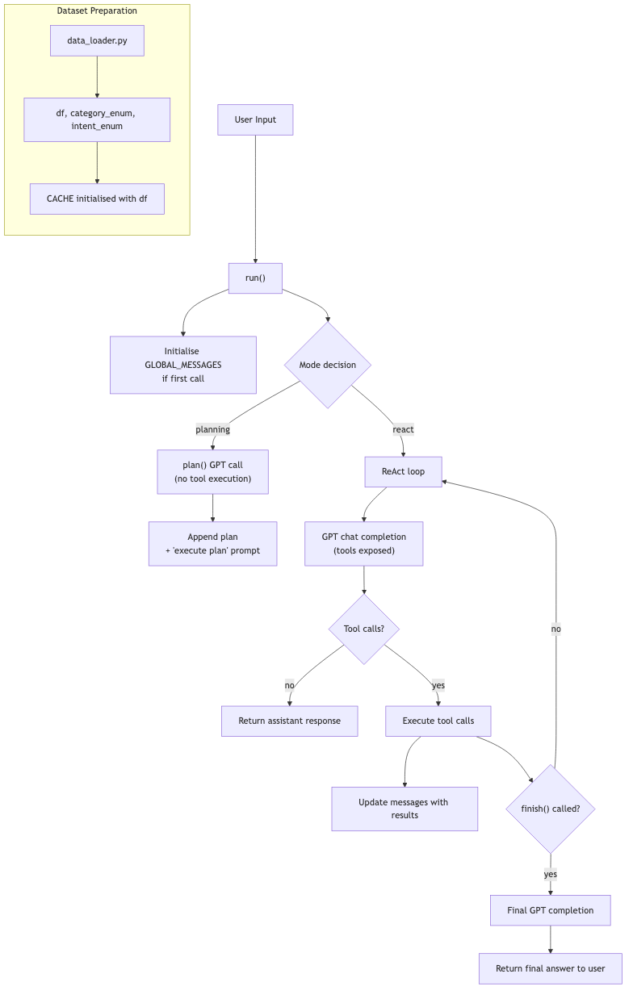

# Customer-Support Dataset Explorer & LLM Agent 🧠

This repository contains a small but complete **LLM-powered assistant** that can answer questions about the [Bitext Customer-Support LLM Chatbot Training Dataset](https://huggingface.co/datasets/bitext/Bitext-customer-support-llm-chatbot-training-dataset) by dynamically calling Python "tools".  
A Streamlit UI is provided for interactive chats and an executable script for quick CLI experiments.

---

## 1. Key Features

* **Dataset-aware agent** – understands the structure of the dataset (instruction, category, intent, response).
* **Function-calling with ReAct** – the OpenAI model can invoke Python helpers such as `count_intent`, `show_examples`, etc.
* **Planning mode** – ask the model to plan its tool calls before execution.
* **Semantic filtering & caching** – results from expensive filters are cached and reused across steps.
* **Streamlit front-end** – chat with the agent in the browser.
* **Architecture diagram** – see `application_flow.png` for an at-a-glance overview.



---

## 2. Repository Layout

```
/README.md                    –-– you are here
/requirements.txt             –- Python deps (install with pip/poetry)

home_work_01/
│   app.py                    –- Streamlit UI
│   main.py                   –- Core agent loop (ReAct + planning)
│   data_loader.py            –- Loads HuggingFace dataset & exposes globals
│   tool_schema.py            –- JSON schema for all function tools
│   llm_config.py             –- Centralised OpenAI client
│   ...

```

---

## 3. How It Works (High-Level)

1. **Dataset load** – `data_loader.py` fetches the dataset once and exposes `df`, `category_enum`, `intent_enum`, and an initial `CACHE`.
2. **Tool schema** – `tool_schema.py` defines a strict JSON schema for each callable Python function.
3. **Agent core** – `main.py::run()` maintains the full chat history, lets the model either:
   * directly call tools (ReAct), **or**
   * first output a textual plan then execute it step-by-step (planning).
4. **Execution loop** – the assistant's tool calls are executed, results injected back into the conversation, and the cycle repeats until `finish()` is called.
5. **Front-end** – `app.py` wraps the pipeline in a simple Streamlit chat interface.

The full control-flow is captured in `application_flow.png`.

---

## 4. Quickstart

1. **Clone & install**

```bash
$ git clone <repo-url>
$ cd <folder>
$ python -m venv .venv && source .venv/bin/activate
$ pip install -r requirements.txt
```

2. **Set your OpenAI key**

Create a `.env` file at project root:

```env
OPENAI_API_KEY=sk-...
```

3. **Run the Streamlit app**

```bash
$ streamlit run app.py
```

4. **CLI demo**

```bash
$ python main.py  # runs a sample query at the bottom of main.py
```

Feel free to edit `main.py` and import `run()` from your own scripts.

---

## 5. Tool Reference

| Function | Purpose |
|----------|---------|
| `select_semantic_intent(intent_names)` | Filter dataframe by intents and cache the subset |
| `select_semantic_category(category_names)` | Same for categories |
| `count_intent(intent_name)` / `count_category(category_name)` | Count rows in current cache |
| `show_examples(n)` | Return *n* random examples from cache |
| `summarize(user_request)` | Toy helper showing arbitrary string handling |
| `finish()` | Signal that the assistant is ready to compose the final answer |

See `tool_schema.py` for the full JSON specs.

---

## 7. Contributing

Contributions and suggestions are welcome!  
Please open an issue or pull request if you have improvements, bug fixes, or new features in mind.

---

## 8. License

MIT © 2024 – *Your Name Here* 